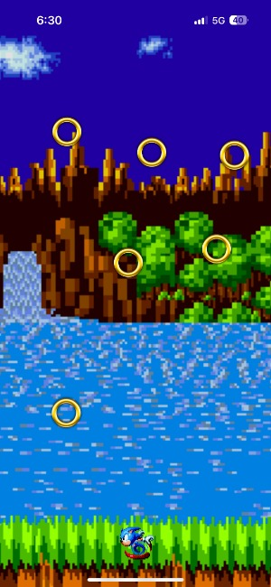

# Table of Contents
- [Forecast App](#forecast-app)
- [Drawing App](#drawing-app)
- [Tilt App](#tilt-app)
- [Global Guesser App](#global-guesser-app)
- [Stopwatch App](#stopwatch-app)
- [Times Tables App](#times-tables-app)

# Forecast App
- Application designed to tell the weather given longitude and latitude coordinates.
- Uses API call to fetch weather data using longitude/latitude and performs reverse geolocation to convert longitude/latitude to an address (APIkey expired for geolocation).
- Displays data for the whole week in a sliding view on the bottom and dynamically changes the UI depending on the weather of the location.
- Both APIkeys are expired and are useless as of now.

# Drawing App
- A drawing app that utilizes an open-source canvas component to render in finger strokes; allowing users to draw on the screen.
- Users can draw several types of shapes on the screen and have various colors to choose from.
- As a demonstration, I drew the Android logo to display the capability and performance of the application.

# Tilt App
- Video game where the user controls the movement of sonic by tilting the phone.
- Fetches data from phone's accelerometer and processes it as movement for sonic depending on the level of the phone tilt.
- Collision detection built to detect if sonic collects rings from the sky or if they hit the ground casuing game to end.

      

# Global Guesser App
-  Guessing game where the user is given an image from a location in the world and they have to place a pin on the map to gues its location.
-  Renders a real world map using an open source react-native-map component for users to place a pin and allows users to switch between the map and score screen using the bottom right cube.
-  Shows a line between the actual and predicted pins, and calculates user score logarithmicaly using distance between the pins.

          

# Stopwatch App
- A basic stop watch that shows user the time and allows the user to stop, start, and reset the watch at any time.
- Allows users to lap the stopwatch and the app stores every lap on a scrollable view.

# Times Tables App
- An application that displays math multiplication problems to users and counts the user's score and high-score.
- Ability to generate problems from a range of number inputted by the user (upper and lower bound).

